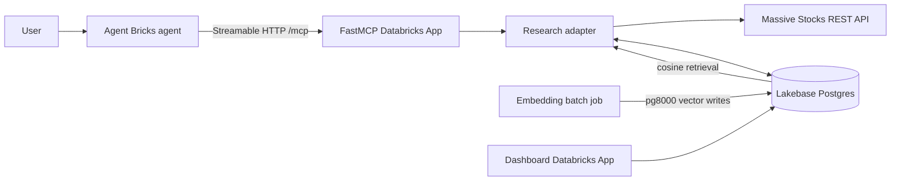

# Signal Desk — AI Stock Market Research Assistant

A standalone Databricks reference implementation that combines a FastMCP
server, Massive Stocks data, Lakebase Postgres/pgvector, an Agent Bricks agent,
and a small activity dashboard. It is isolated from the weather reference app.

## Architecture



The source API is [Massive Stocks](https://massive.com/docs/rest/stocks). The
client uses the official ticker overview, custom daily aggregate bars, news,
SEC EDGAR index, income statement, and balance sheet endpoints. Massive requires an API key;
the key is read from the Databricks secret `massive/api-key` and is never
committed. Fundamentals availability depends on the Massive subscription.

## MCP tools

| Tool | Capability |
|---|---|
| `get_stock_performance` | Most recent entitled snapshot plus daily bars, return, high and low |
| `get_company_research` | Company profile, news and available reported fundamentals |
| `compare_stocks` | Like-for-like price-action comparison for 2–5 tickers |
| `get_watchlist` | User-scoped watchlist with latest locally synced price |
| `update_watchlist` | Explicit add/remove mutation |
| `save_research_note` | Save a confirmed ticker note |
| `save_analysis_report` | Save a confirmed multi-ticker report |
| `semantic_research` | Cosine search over embedded research passages |
| `get_notable_updates` | Price moves and articles since the user's last visit |

Tool functions are intentionally thin. `research_broker.py` owns HTTP calls,
normalization, persistence, calculations, and safe error envelopes.

## Lakebase schema and context engineering

The requested operational tables are `users`, `watchlists`,
`watchlist_tickers`, `companies`, `price_snapshots`, `news_articles`,
`research_notes`, and `analysis_reports`. `research_embeddings` is the derived
retrieval table, and `stock_research_mcp_traces` supports auditability and the
dashboard.

Company profiles keep normalized research columns plus raw JSON provenance.
News has a stable Massive article ID, ticker, narrative fields, publisher,
published time, sentiment metadata, raw payload, and optional full text.
Snapshots preserve OHLCV/VWAP and derived prior-session changes. Notes and
reports are always tied to a user; reports can span several tickers.

The embedding job combines:

- company name, description, sector and industry;
- `filing_excerpt` and `earnings_call_summary` when separately populated;
- news title, description, full text and sentiment reasoning.

It uses 800-character sliding chunks with 100-character overlap and
`sentence-transformers/all-MiniLM-L6-v2` (`vector(384)`). Normalized vectors
are written in batches with pg8000 and indexed with HNSW
`vector_cosine_ops`. Retrieval ranks `1 - (embedding <=> query_vector)`.

## Repository layout

```text
mcp_server/   FastMCP app, Massive client, adapter, Lakebase helper, DDL
jobs/         pg8000 embedding ingestion job
agent/        system prompt, external-MCP config, evaluation scenarios
dashboard/    independent Flask Databricks App
sql/          SQL setup guidance
```

## End-to-end setup

### 1. Configure local authentication

Install and authenticate the Databricks CLI/SDK, then run:

```bash
python setup_secrets.py
```

Paste a Massive API key and a standard Lakebase PostgreSQL URL. Grant the MCP
and dashboard App service principals `READ` on the required secret scopes. For
local-only execution, copy `mcp_server/.env.example` to `.env` and set
`MASSIVE_API_KEY` and `LAKEBASE_URL`; never commit that file.

### 2. Create the schema

Run `mcp_server/schema.sql` in the Lakebase SQL editor, or launch the MCP app
once—its entry point calls `lakebase.migrate()` idempotently. The database must
have pgvector available.

### 3. Deploy the MCP server as its own Databricks App

Create an App whose source directory is `mcp_server/`. The included `app.yaml`
runs `stock_research_mcp_server.py`. Add the Massive and Lakebase secrets as
App resources/permissions, deploy, and verify:

```text
https://<stock-mcp-app>.aws.databricksapps.com/mcp
```

Use Databricks OAuth when registering the endpoint; do not expose it as a
public unauthenticated service.

### 4. Sync research data

Call `get_company_research` and `get_stock_performance` through an MCP inspector
or the agent for the tickers you want. These calls upsert profiles, news, and
daily price snapshots into Lakebase. Optional filing excerpts and earnings-call
summaries can be loaded into their columns by your approved filing/transcript
pipeline; the embedding job automatically includes them.

### 5. Build embeddings

Run the job from a Databricks notebook/job environment with the Lakebase secret:

```bash
pip install -r jobs/requirements.txt
python jobs/ingest_research_embeddings.py --batch-size 100
```

Re-run it after new research is synced. Upserts are deterministic by source,
chunk index, and model.

### 6. Register and test the Agent Bricks agent

In Agent Bricks:

1. Add an **External MCP server** using the MCP App `/mcp` URL and
   Streamable HTTP transport.
2. Select the nine tools listed in `agent/agent_bricks_config.yaml`.
3. Paste `agent/system_prompt.md` as the system instruction.
4. Replace the placeholder endpoint in `agent_bricks_config.yaml`.
5. Run every evaluation question and inspect the tool trace before accepting
   the answer. Confirm ticker, lookback and as-of date alignment.

### 7. Deploy the dashboard independently

Create a second Databricks App from `dashboard/`, grant only the Lakebase
secret permission, and deploy its included `app.yaml`. Databricks forwards the
signed-in user email; local development falls back to `demo@example.com`:

```bash
cd dashboard
pip install -r requirements.txt
LAKEBASE_URL='postgresql://...' python app.py
```

## Validation

From the repository root:

```bash
python -m compileall mcp_server jobs dashboard
pytest -q mcp_server/tests
```

For deployment acceptance, demonstrate price research, multi-ticker
comparison, semantic thesis retrieval, watchlist mutation, saved research,
notable updates, and a clean invalid-ticker/entitlement failure.

## Limitations and improvements

- Data latency, history, news, and financial statements vary by Massive plan.
- The tool requests Massive's current single-ticker snapshot, but fields and
  latency depend on plan entitlements; it falls back explicitly to the latest
  eligible daily aggregate. WebSockets would improve continuous intraday use.
- Massive company overview is not a full SEC filing/transcript feed. The schema
  deliberately accepts approved filing excerpts and earnings summaries, but a
  production system should add SEC EDGAR/transcript ingestion with source URLs,
  filing dates, and licensing controls.
- The job re-embeds candidate text each run before deterministic upsert. At
  scale, filter by content hash first and use a managed job schedule.
- A 5% notable-move threshold is intentionally simple. Production alerting
  should adjust for volatility, corporate actions, market sessions, and user
  preferences.
- The assistant supports research, not trade execution or personalized advice.
  Add formal evaluation, role-based access, retention policies, and human review
  before regulated use.
